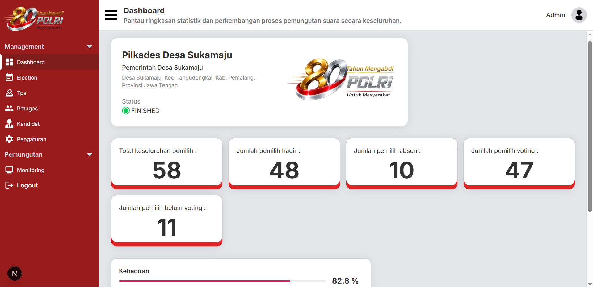
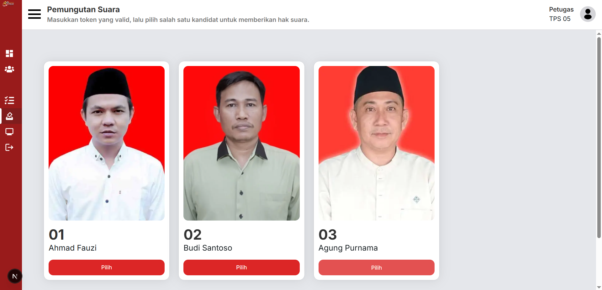
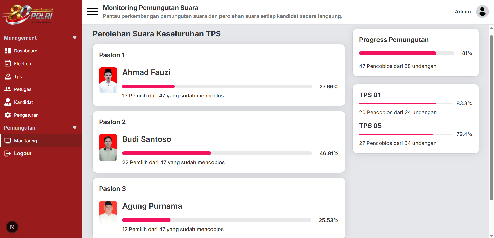

# VoteDesk Election Management System — Frontend

Frontend aplikasi **Election Management System (EMS)** yang dirancang untuk membantu penyelenggara mengelola proses pemilihan secara digital, mulai dari pengelolaan pemilihan, tempat pemungutan suara, petugas, pemilih, kandidat, hingga proses pemungutan dan monitoring hasil.

VoteDesk menggunakan pendekatan **multi-election**, sehingga satu sistem dapat digunakan untuk berbagai pemilihan dengan data masing-masing tetap terisolasi.

## 📸 Preview







## ✨ Features

### 🔐 Authentication & Access Control

* Login & Register
* Role-based access
* Protected pages
* Session management

### 🗳️ Election Management

* Create & manage election
* Election information management
* Election status management
* Election-specific data isolation

### 👥 User & TPS Management

* Management Petugas
* Management TPS
* Assign Petugas to TPS
* Active / inactive user management

### 🧑‍🤝‍🧑 Voter Management

* Management data pemilih
* Search & pagination
* Voter attendance
* Voter status management

### 👤 Candidate Management

* Management kandidat
* Candidate ordering
* Candidate information

### 🎟️ Voting & Token

* Generate voting token
* Token validation
* Token expiration
* Token printing
* Voting flow
* Vote confirmation

### 📊 Monitoring & Results

* Election monitoring
* Voting progress
* Real-time vote updates
* Candidate vote monitoring
* Election result

### 📄 Report

* Election result report
* Export result to PDF

### 📱 User Interface

* Responsive design
* Dashboard-based interface
* Modal-based voting flow
* Form validation
* Interactive notifications

## 🛠️ Tech Stack

### Frontend

* Next.js
* React.js
* TypeScript
* Tailwind CSS
* HeroUI

### State & Data Management

* TanStack React Query
* React Hook Form

### Authentication

* NextAuth
* JWT

### Real-Time Communication

* Socket.IO

### Supporting Libraries

* React Datepicker
* Framer Motion
* PDF-related integration

## 🔄 Voting Flow

Proses pemungutan suara pada VoteDesk dirancang dengan beberapa tahap untuk menjaga alur pemilihan tetap terkontrol.

```text
Voter hadir
    ↓
Petugas mencatat kehadiran
    ↓
Token voting dibuat
    ↓
Voter memasukkan token
    ↓
Token divalidasi
    ↓
Daftar kandidat ditampilkan
    ↓
Voter memilih kandidat
    ↓
Konfirmasi pilihan
    ↓
Vote berhasil disimpan
    ↓
Status voter diperbarui
```

Token voting memiliki masa berlaku dan hanya dapat digunakan sesuai dengan aturan yang ditentukan oleh sistem.

## ⚡ Real-Time Monitoring

VoteDesk menggunakan **Socket.IO** untuk mendukung pembaruan data secara real-time.

Ketika terjadi vote baru, frontend dapat menerima event dari server sehingga informasi monitoring dapat diperbarui tanpa harus melakukan refresh halaman secara manual.

Secara sederhana:

```text
Voter
  │
  │ Submit Vote
  ▼
Backend
  │
  │ Vote berhasil
  │
  └──────► Socket.IO Event
                 │
                 ▼
          Monitoring Dashboard
                 │
                 ▼
          Data diperbarui
```

Komunikasi real-time juga menggunakan authentication sehingga koneksi dapat dikaitkan dengan election yang sesuai.

## 🏢 Multi-Election Architecture

VoteDesk dirancang dengan konsep **multi-election**.

Satu aplikasi dapat digunakan untuk mengelola beberapa pemilihan, sementara data operasional setiap pemilihan tetap terisolasi.

Contohnya:

```text
Election A
├── Users
├── TPS
├── Voters
├── Candidates
├── Tokens
└── Votes

Election B
├── Users
├── TPS
├── Voters
├── Candidates
├── Tokens
└── Votes
```

Frontend tidak perlu mengirim `electionId` secara manual pada setiap request. Konteks election ditentukan melalui authentication dan dikelola oleh backend.

## 🔗 Backend

Frontend ini terhubung dengan backend REST API yang dibangun menggunakan:

* Node.js
* Express.js
* TypeScript
* Prisma
* PostgreSQL

Backend juga menangani authentication, authorization, election isolation, voting process, dan real-time communication menggunakan Socket.IO.

📂 **Backend Repository**

[VoteDesk Election Management System — Backend](https://github.com/frhn-06/backend-pilkades-frhn)

## ⚙️ Installation

Clone repository:

```bash
git clone https://github.com/frhn-06/frontend-pilkades-frhn.git
```

Masuk ke folder project:

```bash
cd frontend-pilkades-frhn
```

Install dependencies:

```bash
npm install
```

Jalankan development server:

```bash
npm run dev
```

Aplikasi akan berjalan pada:

```text
http://localhost:3000
```

atau

```text
http://localhost:3001
```

## 🔑 Environment Variables

Buat file `.env.local` pada root project.

Contoh:

```env
NEXT_PUBLIC_API_URL=

NEXTAUTH_SECRET=

NEXT_PUBLIC_SOCKET_URL=
```

## 🚀 Deployment

Frontend dapat di-deploy menggunakan platform seperti Vercel.

Production:

[VoteDesk Election Management System](https://frontend-pilkades-frhn.vercel.app)

## 📚 About This Project

VoteDesk Election Management System merupakan project **Full-Stack Web Development** yang dibuat untuk mempelajari dan mengimplementasikan sistem pemilihan secara digital.

Project ini mencakup berbagai proses, mulai dari pengelolaan election, petugas, TPS, pemilih, dan kandidat hingga proses pemungutan suara menggunakan token.

Salah satu fokus utama project ini adalah penerapan **multi-election architecture**, sehingga satu sistem dapat digunakan untuk berbagai pemilihan dengan data yang tetap terisolasi.

Project ini juga menjadi sarana untuk memperdalam pemahaman mengenai **authentication & authorization, REST API, database management, real-time communication menggunakan Socket.IO, file upload, voting workflow, serta pembuatan laporan PDF**.
